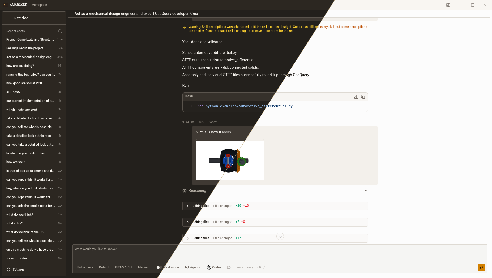

# Amarcode

> A calm, focused home for your AI coding agents.

Amarcode is a desktop app that lets you work with AI coding agents in one
place. Open a project, choose an agent, and chat with it while it helps you
understand and improve your code.

  Designed to stay out of the way while you and your agent get things done.

## What you can do

- Chat with different coding agents.
- Ask questions about your project
- Follow the agent's progress as it works
- Review file changes inside the app
- Leave task to run in background without supervision

Amarcode uses the open [Agent Client Protocol](https://agentclientprotocol.com/),
allowing it to work with a growing range of compatible agents. (chatgpt, claude, grok, antigravity, cursor, ...)

## Project status

Amarcode is currently under active development. Features and supported agents may change
as the project evolves.
